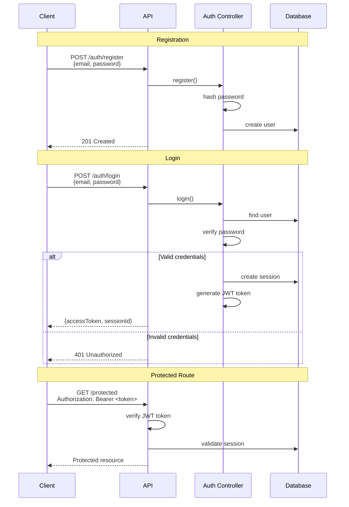

# Authentication Flow Diagram

## Key Components

### 1. **Registration**
- User provides email and password
- Password is hashed and stored in database
- Returns success response

### 2. **Login**
- User provides email and password
- System validates credentials
- On success: creates session and returns JWT token
- On failure: returns unauthorized error

### 3. **Protected Routes**
- Client sends JWT token in Authorization header
- API verifies token and validates session
- Grants access to protected resources

## Security Features
- **Password Hashing**: bcrypt encryption
- **JWT Tokens**: Secure access tokens with expiration
- **Session Management**: Database-backed sessions
- **Token Validation**: Signature and type verification
